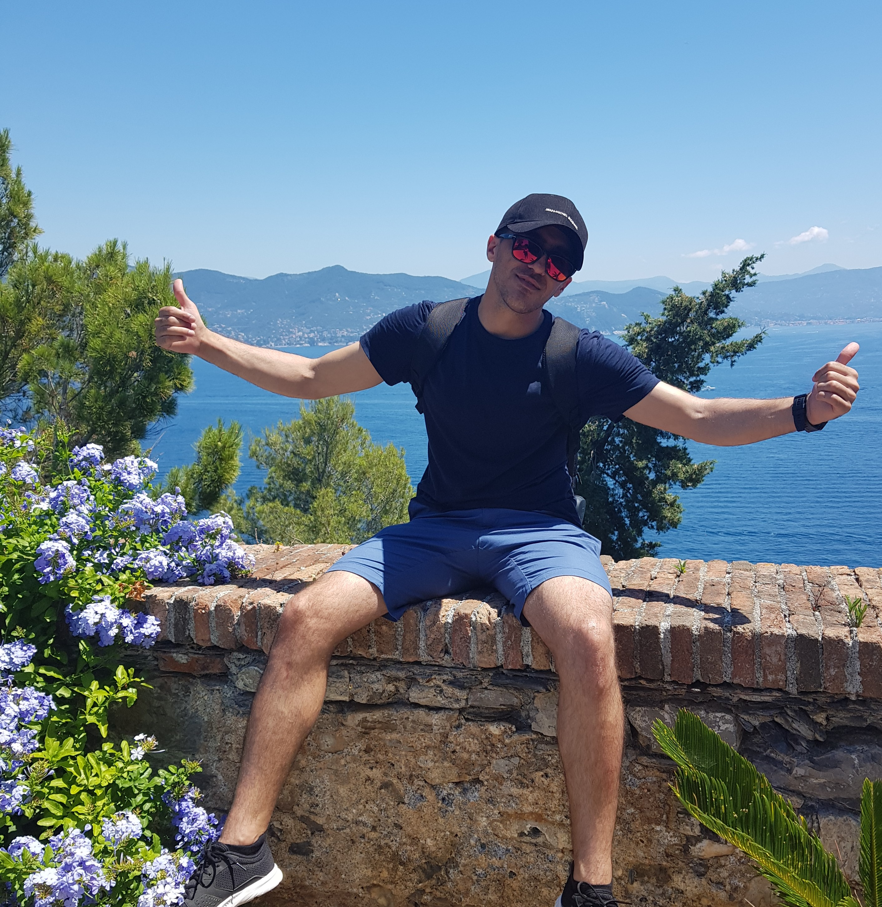

```{r setup, include=FALSE}
knitr::opts_chunk$set(echo = FALSE,
                      message = FALSE,
                      error = FALSE,
                      warning = FALSE, 
                      fig.align = "center")
```
***
I have finished master degree in Electronic and Information Engineering Feb. 2019 at (*Chonbuk National University*), South Korea. After spending my Bachelor and MSc study on computer science and electronic engineering, i moved to Italy to countinue my studey in Computational Biology at 
*European school of molecular medicine*.</p>

<p style='font-size:15px;' align='justify'> As a highly motivated postgraduate majoring in MSc (Electronic and Information Engineering) at
Chonbuk National University, South Korea, I have gained distinctive academic results, hands-on
experience in different research areas and leadership skills. Besides courses listed on my transcript,
I did a lot of experiments in relation to these courses. My outstanding academic performance
directed me to get a chance to work with a research group which in turn led me to improve my
research skills and I get familiarized with many bioinformatics tools. My experience at Chonbuk National University and my former university has taught me to coordinate my efforts with other highly motivated individuals.</p>

<p style='font-size:15px;' align='justify'> My passion for programming and computational biology was not limited to a narrow range. My
interest in it began from undergraduate and continued in my master; it is such a promising area.
It is an ideal research area for aspiring bioinformaticians to keep themselves up to date with the
latest technologies and to make innovations.
I wish to delve deeper into the subjects to be able to carry out independent research and analysis

Furthermore, I moved to Milan to work as a bioinformatician in the Istituto Europeo di Oncologia, where I have been granted with the SEMM PhD Fellowship to do a 4-year PhD in Computational Biology, under the supervision of Dr.Pier giuseppe pelicci and Dr.Lucila luzi. </p>

My purpose for studing this PhD program (*Computational Biology*) is to both expand on my solid education and to
create more opportunities for myself in the future. My ultimate goal is to become an expert bioinformatics and data mining and then deliver my research experience and ideas in education and research field. </p>


```{r about_me_1, echo=FALSE, fig.cap="Portofino, Italy", out.width="50%"}

```


<br><br><br><br>
<br><br><br><br>
<br><br><br><br>